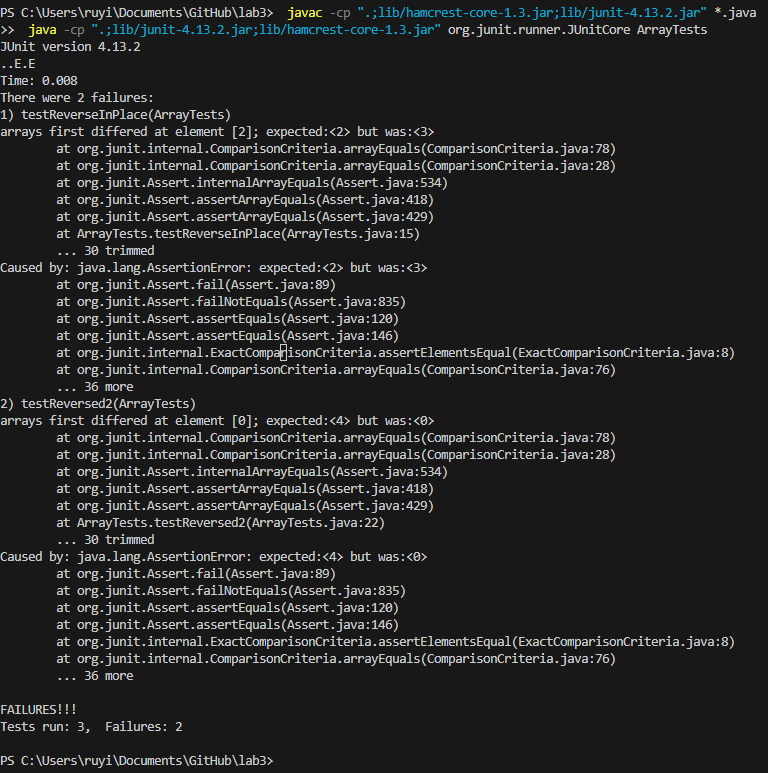

# Part1 : Bug

### Success Example:

@Test

public void testRight(){  

    int [] input = {};
    
    assertArrayEquals(new int[]{}, ArrayExamples.reversed(input));  
  }

### Failure Example:

@Test

public void testReverseInPlace(){

    int[] input1 = {1,2,3,4};
    int[] test = {4,3,2,1};
    ArrayExamples.reverseInPlace(input1);
    assertArrayEquals(test,input1);
    
  }

### Output Example:

### The bug:

#### Before Fix:

static int[] reversed(int[] arr) {

    int[] newArray = new int[arr.length];
    for(int i = 0; i < arr.length; i += 1) {
      arr[i] = newArray[arr.length - i - 1];
    }
    return arr;
    
  }

#### After Fix:

static int[] reversed(int[] arr) {

    int[] newArray = new int[arr.length];
    for(int i = 0; i < arr.length; i += 1) {
      newArray[i] = arr[arr.length - i - 1];
    }
    return newArray;
    
  }

# Part2 Research Command:

### find . -size:

>find . -size -10k -type f

>find . -size +10k -type f

#### Output: 

-10k:

>/government/About_LSC..........

>.........

>/911report/preface.txt

> (list of file name)

+10k:

>.........

>/911report/chapter-11.txt

* The "." is mean to find file under current directory and subdirectory

* The "-size" is take one argument(in this case "+10k" and "-10k" is argument), return true if file use specific space on the disk. Ex. +10k is mean file greater than 10 kilobytes

* -type f is file type , f is mean regular file.

* This command will show the size of file, if we want to find a specfic file size, we can use this command to easy to get all the file that fit the requirement.

### find . -delete: 

>find . -delete -size -10k -type f

>find . -delete -name '*.txt*' -type f

#### Output:

None if success, print error if failure.

* The "-delete" command is to delete file if that file return true. In the first case, it will delete all regular file that less than 10 kilobytes

* We can use "delete" command to delete file under many condition. For example, file with specifc name, size, directory,etc.

### find . -o:

>find . -name '*.txt' -o '*911*'

>find . -size +10k -o -size -3k

#### Output:

(list of file name)

* The "-o" is mean boolean "or" operator. We can use this command to find file that match different condition. Ex. first one is file that contain '.txt' as prefix and '911' include in the text.

### find . maxdepth:

>find . maxdepth 3 -name '*.txt'

>find . mandepth 4 -delete -name '*.txt'

#### Output:

(list of file name)

* The "maxdepth" is to use limit the subdirectory. The '.' command will search current directory and all subdirectory and all subdirectory's subdirectroy.
* In this case, maxdepth 3 will limit find until 3 level of dirctory. if we have something like /home/level1/level2/level3/level4. It will only find until level3, not level4.

[Outside Resource(reference)](https://www.computerhope.com/unix/ufind.htm)
